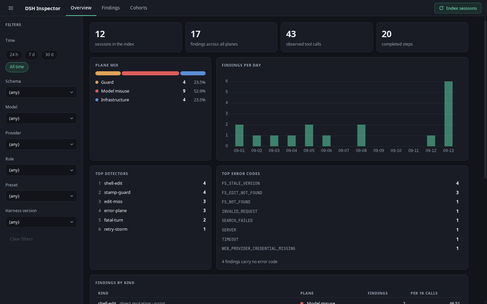
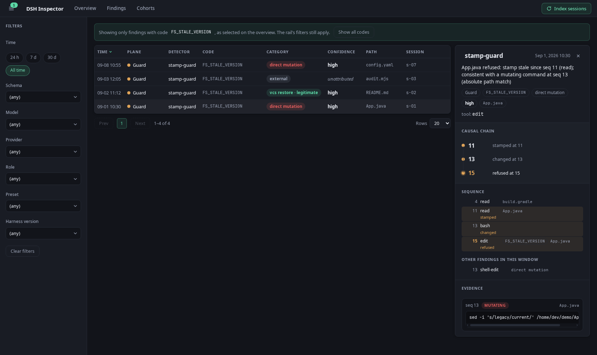

# DSH Inspector

DSH Inspector indexes the local session logs of the DeepSeek Harness (DSH) — the agent's
own infrastructure — and renders them as a read-only web dashboard of failure rates and
attributed causes. It answers two questions: "is this build worse than the last one?",
answered as a rate against a baseline cohort — and, since rev 5, as a verdict with a
confidence interval behind it — and "why did this one go wrong?", answered as the causal chain
behind a single finding and the sequence of tool calls around it.

## Quickstart

```bash
git clone <this repository>
cd "DSH Inspector"
./run-demo.sh
```

Open http://127.0.0.1:4300. That is the whole manual step: the script builds the jar if
`backend/target/*.jar` is missing or older than the source, installs the frontend dependencies if they are missing,
indexes the committed fixture corpus, and only then starts the two processes — so the
dashboard arrives populated and complete, with no database, no jar and no flag to remember.
Ctrl-C stops both.



Every screen is driven by one filter contract, so the tiles, the table and the cohort rates
can never describe different populations, and the URL describes whatever is on screen —
a filtered view is a link. Opening a finding gives the second question its answer: the stamp
that went stale, the command that moved it, and the refusal, in sequence order, with the
command excerpt truncated and credential-masked before it was ever stored.



## Decisions and trade-offs

- The indexer keeps raw session lines only inside the ingest layer, and the store has no
  column that could hold conversation text; that boundary is enforced by a test that
  reflects over every compiled main class, not by a convention someone might forget.
- A stamp-guard violation is attributed to the first command, chosen by sequence number, in
  the open interval between the stale stamp and the refused write that could have moved the
  stamp — never by which verb looks worse; a `git restore` that precedes a mutation stays
  the cause, because it is the one that invalidated the stamp.
- Rates are findings per 1,000 *observed* tool calls, excluding the 794 of 17,244 rows that
  are a result with no matching call, because a denominator that counted them would
  understate every rate and shift whenever the harness writes a result line.
- Storage is one SQLite file behind Spring Data JPA, with `schema.sql` as the DDL that Hibernate
  validates against and a schema-version gate that rebuilds instead of a migration engine: the
  index is derived and disposable, so migrations would be machinery more expensive than the data
  they protect. The gate runs before validation, because on a file an older build wrote, a
  validation failure is a failed boot where the right answer is a rebuild.
- There is no authentication, no incremental indexing, no datepicker and no mobile layout;
  each is named with its reason in docs/DESIGN.md, and a full re-index of the measured
  168 stream corpus takes about 2 s, which is why re-indexing is the shipped answer to most
  of them.

## What it refuses to do

- **No conversation text anywhere in the store.** The schema has no column that could hold
  a message body. The one endpoint that returns any text at all is the finding-detail
  endpoint, and it returns only the truncated, credential-masked command excerpt of the
  evidence — a type that lives inside the ingest layer and never crosses the API boundary.
- **No raw tool arguments.** Detectors see paths, verbs, sequence numbers and outcomes;
  argument payloads never leave ingest.
- **No corpus in this repository.** `corpus/` is gitignored. The committed fixtures are
  generated with invented paths and project names, and nothing personal is in the tree.

The first two refusals are enforced, not assumed: `PrivacyBoundaryTest` walks every compiled
main class and fails if a content type or a content field name appears outside
`inspector.ingest`.

## Deliberately left out

- **Authentication.** A local process reading its own logs; the design defers the question
  until a session id could actually leave the machine (docs/DESIGN.md, "Not built, by
  decision", and §10).
- **Incremental indexing / file watching.** A full re-index of the measured 173 MB, 168
  stream corpus takes about 2 s (ingest runs in parallel, writes stay serial), so watching would be machinery to hide a wait that does not
  exist (docs/DESIGN.md §2, §12).
- **A datepicker.** Four presets (24 h / 7 d / 30 d / all time) cover the click-to-filter
  interaction; `from`/`to` remain in the API, so it is a UI-only cut (docs/DESIGN.md §8).
- **CORS for a statically served frontend.** The dev server proxies `/api`, so same-origin
  holds in development. There is no static deployment with a recipient today, so a CORS
  whitelist would be a seam with no one on the other side (docs/DESIGN.md §2, §10).
- **Migrations.** One SQLite file, with a schema-version gate that wipes and re-indexes. A
  migration engine is deferred until a second schema version is real (docs/DESIGN.md §4.2,
  §9).

## Judging a harness change

The dashboard's cohorts say what the rates are; a loop that changes the harness needs to know
whether a difference is real. Four pieces, all over the same filter as every other screen:

- **A harness timeline.** Session logs do not record which harness version they ran under. Copy
  `harness-timeline.example.yml` to `harness-timeline.yml` (gitignored) and add one entry per
  change — instruction file, route, model, timeout. Every `run.sh` mode imports it, and each
  session gets the version that was live when it started.
- **The judge** — `GET /api/judge?groupBy=harnessVersion&baseline=…&candidate=…`. Per code, per
  plane and in total: both rates per 1,000 calls, the rate ratio with a 95% interval widened for
  failures that cluster in a few sessions (and read on a t quantile, so evidence from one or two
  sessions cannot decide anything), and a verdict (`better`, `worse`, `inconclusive`, or
  `no-data` when a side has no calls) read from the interval, never from the point estimate. `?role=orchestrator` or `?provider=…` narrows
  it to one model on a setup that serves several under one model id.
- **Findings by kind** — `GET /api/breakdown`: detector, category, code and detail, each with its
  rate. A failed edit is split by what came before it (the model's own edit, a read, the same
  failed edit), and a shell command that rewrote a tracked file is counted on its own.
- **The sequence around a finding** — `GET /api/findings/{id}/context`: the tool calls of its
  stream before and after it, structure only.


On the fixtures every verdict is "inconclusive", and that is the point of the screen: seventeen
findings cannot tell two harness versions apart, and a tool that let a reader believe otherwise
would be the dangerous kind.

For an agent running between two changes there is a headless form that binds no port:

```bash
INSPECTOR_BASELINE=v1 INSPECTOR_CANDIDATE=v2 ./run.sh report [corpus] [out.json]
```

It indexes, writes one JSON snapshot (board, breakdown, cohorts by version, model, provider and
role, the judge's verdicts, recent findings) and exits. It describes real sessions: read it, do not
publish it.

## Looking at your own sessions

```bash
./run-live.sh                    # reads ~/.dsh/sessions
./run-live.sh /path/to/sessions  # or somewhere specific
```

Same dashboard, real data. It reads your session logs read-only, indexes into
`backend/inspector-live.sqlite` so a demo index is never overwritten, and prints a reminder
on the way up: findings from a live corpus quote **real paths and real commands**, so a
screen from this run is not a screen to publish.

The two commands are two-line wrappers around `run.sh`, which takes the mode as its first
argument. Everything else — build, index, ports, shutdown — exists once in that file.

Under the hood the flag is `--inspector.corpus=/path/to/sessions`, and it resolves against
the JVM's working directory, which is why the scripts start the JVM inside `backend/` (and
why the committed default is the relative path `fixtures/sessions`). From `backend/`:

```bash
mvn -q -DskipTests package
java -jar target/dsh-inspector-0.1.0.jar --inspector.corpus=/path/to/sessions
```

then `cd frontend && npm start` and open http://127.0.0.1:4300.

The index is derived data: the SQLite file is a cache of the corpus, and it is wiped and
re-indexed rather than migrated when either the schema version or **the corpus it was built
from** no longer matches the one configured. A database also records which corpus its rows
came from, because a file holding an index of your real sessions must not be able to answer a
run configured for the fixtures — "rows present" is not the same question as "rows from this
corpus".

## Tests, ports and the two backend surfaces

```bash
cd backend && mvn test                 # 323 tests, 1 skipped (the corpus smoke: -Dinspector.smoke=true)
cd frontend && npm test -- --watch=false   # 181 tests; Vitest 4 + jsdom, run through the Angular builder
```

| Port | What |
|---|---|
| 8091 | backend, bound to 127.0.0.1 only |
| 4300 | Angular dev server; proxies `/api` to 8091 |

The ports are a design constraint, not a default: the inspector runs beside the tool it
observes, on a machine where the obvious ports are already owned. A collided port fails at
startup with the port named in the message.

Two things on the backend itself, for a reader rather than for the dashboard:
http://127.0.0.1:8091/swagger-ui/index.html renders the generated OpenAPI document
(`http://127.0.0.1:8091/v3/api-docs` is the document), and
`http://127.0.0.1:8091/actuator/health` answers `UP` with `liveness` and `readiness` groups.
Health is the only actuator endpoint exposed, deliberately: `env` and `configprops` would
print the configured corpus path, which carries the username.

## How it was built, and where to look

It is self-referential by design: it was designed and built inside DSH by a locally hosted
agent stack, with nothing leaving the machine — so on the author's own corpus the tool
measures the harness that built it. The read side was later worked on with a hosted
assistant as well. `docs/AI-NOTES.md` §0 draws that line precisely, down to which packages
each side has and has not touched, and every commit with hosted assistance in it carries a
`Co-Authored-By` trailer, so the split is checkable rather than asserted. The committed
fixtures are synthetic, so `./run-live.sh` is where the self-reference actually closes.

Thirty minutes, in this order:

1. **`docs/DESIGN.md` §1 and §2** — the question the tool answers, and the list of things
   deliberately not built. §2 is the shortest route to what was traded away.
2. **`backend/src/main/java/inspector/detect/StampGuardDetector.java`** — the one piece of
   real domain reasoning. Attribution is abductive and the summary says "consistent with",
   because the log never records what modified a file.
3. **`docs/AI-NOTES.md` §3** — the defect ledger: what broke during construction, how it was
   caught, and what it would have cost. It is the honest account of how the code got here.

If you would rather read a rule than a paragraph: `FilterContractTest`,
`PrivacyBoundaryTest`, `PackageCycleTest` and `frontend/src/app/architecture.spec.ts` are
the project's conventions written as build failures rather than as comments.

## License

MIT — see [LICENSE](LICENSE).
